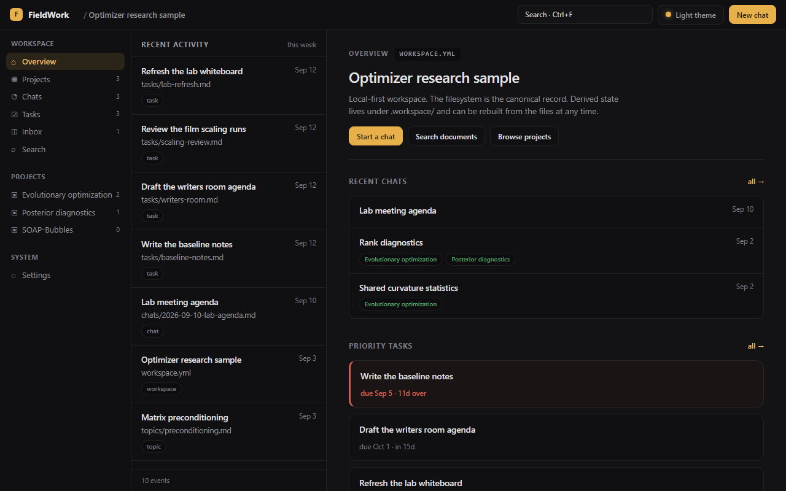
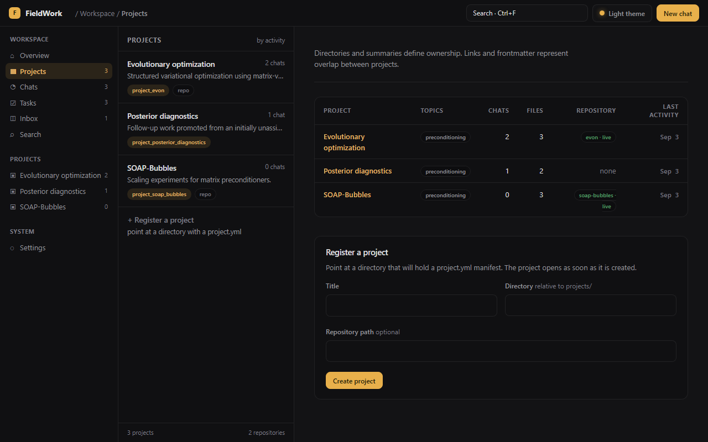
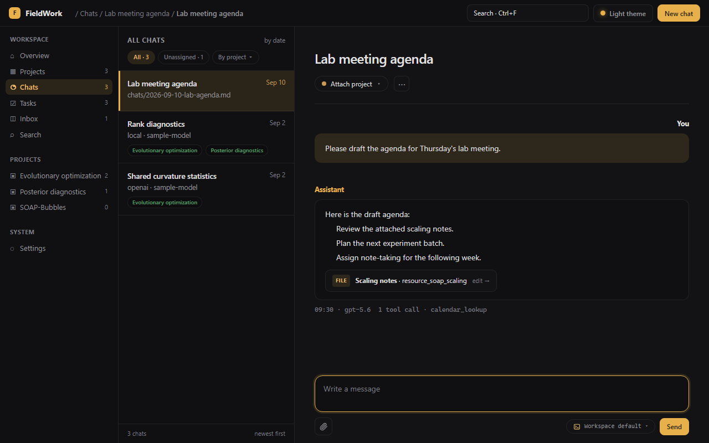
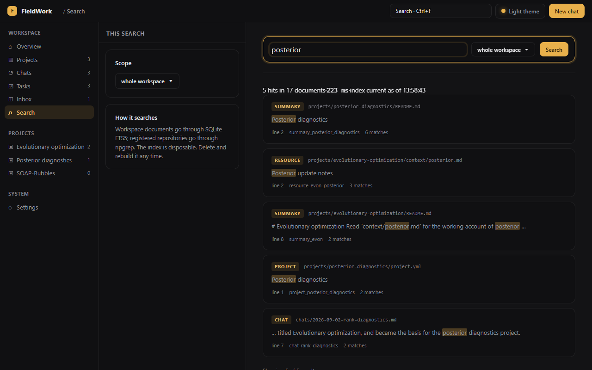

# FieldWork

FieldWork is a local-first research workspace for projects, notes, chats, code, papers, experiments, and selected conversations from remote services.

The filesystem is the canonical record. Markdown, YAML, repositories, and local resources stay readable on their own. On top of them FieldWork adds project views, retrieval, chat lifecycle operations, file watching, and a disposable search index. No private database, no hosted service.

## What it does

- Organize research into projects with resources, topics, and registered repositories.
- Capture chats in the browser or from the CLI. Attach a chat to projects later, or promote it into a project of its own. Transcripts are ordinary Markdown either way.
- `search` finds text in workspace files and registered repositories with SQLite FTS5 and ripgrep. `context` assembles a bounded bundle of evidence for a query, with the trail that led to each document.
- Chats run against an OpenAI-compatible endpoint, the OpenCode CLI, or an Agent Client Protocol harness such as Codex. You can switch backends per turn; the stored conversation does not change. A credential pasted in the browser stays in server memory and never reaches a file.
- `fieldwork serve` runs the local web app and its JSON API.

Version 0.2.0 completes Phase 0, 1, and 2. Remote connectors, model-generated answers, a graph database, a vector index, and multi-user administration are not included yet. [PLAN.md](PLAN.md) covers the product direction, [SCHEMA.md](SCHEMA.md) defines the versioned file contract, and the [wiki](https://github.com/adrianrob1/FieldWork/wiki) is the full user guide.

## The web app

`fieldwork serve` starts the local web app at `http://127.0.0.1:1774`, with views for the workspace, projects, chats, tasks, inbox, search, and settings. It works on the same files and index as the CLI, so you can move between the browser and the terminal freely.









## Setup

You need Node.js 24 or later and Git. ripgrep is optional; put `rg` on `PATH` if you want to search inside registered repositories.

```sh
git clone https://github.com/adrianrob1/FieldWork.git
cd FieldWork
npm ci
npm run build
npm link
```

Copy the sample workspace to try it. Leave the checked-in sample untouched, because commands create disposable files under `.workspace`:

```sh
cp -R examples/sample-workspace ../my-fieldwork-workspace
fieldwork validate --workspace ../my-fieldwork-workspace
fieldwork rebuild --workspace ../my-fieldwork-workspace
fieldwork serve --workspace ../my-fieldwork-workspace
```

Open `http://127.0.0.1:1774`, configure a backend on `/settings`, and start a chat on `/chats/new`. When you leave `--workspace` off, the CLI searches upward for `workspace.yml`.

The wiki has the full walkthroughs: [Getting started](https://github.com/adrianrob1/FieldWork/wiki/Getting-Started), backend configuration and the Codex agent install in [Chats and backends](https://github.com/adrianrob1/FieldWork/wiki/Chats-and-Backends), and [Troubleshooting](https://github.com/adrianrob1/FieldWork/wiki/Troubleshooting).

## Commands

```text
fieldwork validate [--json]
fieldwork rebuild [--json]
fieldwork watch [--debounce <ms>]
fieldwork serve [--port <n>] [--host <addr>]
fieldwork project list [--json]
fieldwork project show <project-id> [--json]
fieldwork project register <directory> --id <id> --title <title> [--repository <path>] [--json]
fieldwork chat attach <chat-id> --project <project-id> [--json]
fieldwork chat detach <chat-id> --project <project-id> [--json]
fieldwork chat promote <chat-id> --id <project-id> --title <title> [--directory <name>] [--json]
fieldwork chat start --id <chat-id> --title <title> [--topic <topic>] [--project <project-id>] [--message <text>] [--json]
fieldwork chat send <chat-id> --message <text> [--backend <name>] [--json]
fieldwork chat show <chat-id> [--json]
fieldwork backend list [--json]
fieldwork search <query> [--project <project-id>] [--json]
fieldwork context <query> [--project <project-id>] [--chat <chat-id>] [--json]
```

Every command accepts `--workspace <path>`, and commands with a finite result accept `--json`. Run `fieldwork <command> --help` for the complete options.

## Development

```sh
npm run check          # build, lint, format check, unit and integration tests
npm run test:browser   # Playwright acceptance tests; run `npx playwright install chromium` once first
```

CI runs `npm ci` and `npm run check` on Node.js 24 across Windows, macOS, and Linux. See [Development](https://github.com/adrianrob1/FieldWork/wiki/Development) for details. Browser routes and JSON endpoints are documented in [Web app and API](https://github.com/adrianrob1/FieldWork/wiki/Web-App-and-API).

## Roadmap

Phase 0, 1, and 2 are complete. The Phase 2 browser work is archived as [LookHere issue #39](https://github.com/adrianrob1/LookHere/issues/39). Phase 3 evaluates retrieval behavior and adds explicit low-confidence outcomes. Later work covers remote snapshots, stronger lifecycle tools, and optional semantic search.

Development is tracked through the repository's [milestones](https://github.com/adrianrob1/FieldWork/milestones) and the [FieldWork roadmap project](https://github.com/users/adrianrob1/projects/4).

The sample fixture lives in [examples/sample-workspace](examples/sample-workspace). `pwsh -NoProfile -File scripts/validate-sample-workspace.ps1` replays attach, detach, promote, rename, and repository relocation against a temporary copy and compares the result with the checked-in state.

## License

[GPL-3.0](LICENSE)
